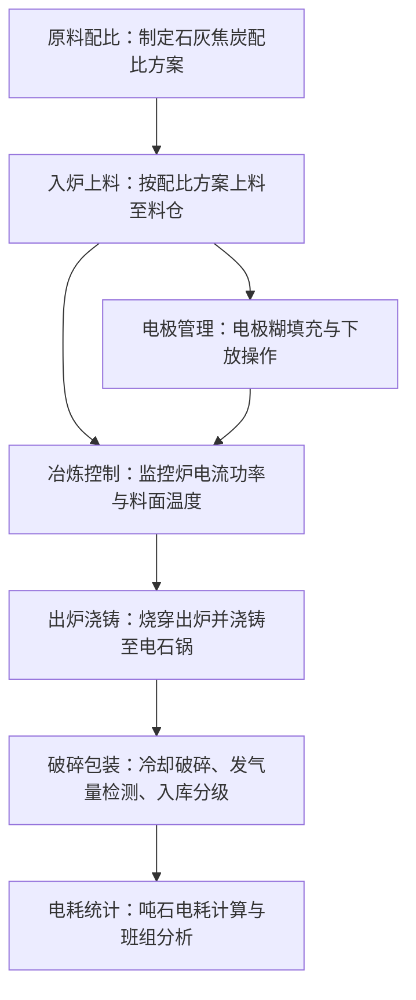

## 1. 产品概述

电石炉生产车间电石冶炼业务客户端软件，面向电石生产车间操作员和管理人员，用于全流程管理从原料配比到成品入库的电石冶炼生产环节。
- 解决电石冶炼过程中配料计算、上料跟踪、电极维护、冶炼监控、出炉浇铸、破碎包装和电耗分析等关键业务的信息化管理问题
- 目标用户为电石车间操作工、班组长和车间主任，提升生产管理精细化水平和数据追溯能力

## 2. 核心功能

### 2.1 用户角色

| 角色 | 登录方式 | 核心权限 |
|------|----------|----------|
| 操作工 | 工号+密码 | 日常操作记录（配料、上料、电极、出炉、破碎） |
| 班组长 | 工号+密码 | 操作工全部权限 + 班组数据查看与审核 |
| 车间主任 | 工号+密码 | 全部权限 + 统计分析、参数配置、报表导出 |

### 2.2 功能模块

1. **原料配比**：石灰焦炭配比方案管理、配比计算与调整
2. **入炉上料**：料仓上料记录、批次追踪、库存监控
3. **电极管理**：电极糊填充记录、电极下放量记录与趋势
4. **冶炼控制**：炉电流功率实时监控、料面温度监控与告警
5. **出炉浇铸**：出炉烧穿记录、电石锅浇铸操作与追踪
6. **破碎包装**：电石冷却破碎记录、发气量检测、入库分级管理
7. **电耗统计**：吨石电耗计算、历史趋势分析、班组对比

### 2.3 页面详情

| 页面名称 | 模块名称 | 功能描述 |
|----------|----------|----------|
| 仪表盘总览 | 数据概览 | 今日产量、当前炉况、电耗概览、待办事项 |
| 原料配比页 | 配方管理 | 石灰焦炭配比方案的新建、编辑、查看，支持配比计算器 |
| 原料配比页 | 配比记录 | 历史配比调整记录，按炉次/时间查询 |
| 入炉上料页 | 上料记录 | 每次上料的料仓编号、原料批次、重量、时间记录 |
| 入炉上料页 | 料仓监控 | 各料仓当前料位、库存预警 |
| 电极管理页 | 电极糊填充 | 电极糊添加量、添加时间、操作人记录 |
| 电极管理页 | 电极下放 | 电极下放量、下放时间、位置记录与趋势图 |
| 冶炼控制页 | 炉电流功率 | 三相电流、功率实时显示与历史曲线 |
| 冶炼控制页 | 料面温度 | 料面各测温点温度实时显示与告警 |
| 出炉浇铸页 | 出炉烧穿 | 出炉时间、烧穿方式、烧穿时长记录 |
| 出炉浇铸页 | 电石锅浇铸 | 浇铸锅号、液态电石量、浇铸时间记录 |
| 破碎包装页 | 冷却破碎 | 冷却时长、破碎粒度、破碎量记录 |
| 破碎包装页 | 发气量检测 | 发气量检测值、检测时间、合格判定 |
| 破碎包装页 | 入库分级 | 产品等级判定、入库数量、批次号管理 |
| 电耗统计页 | 吨石电耗 | 当班/当日/当月吨石电耗计算与趋势 |
| 电耗统计页 | 班组对比 | 各班组电耗、产量对比分析 |

## 3. 核心流程

电石冶炼生产的核心流程为：原料配比 → 入炉上料 → 电极管理 + 冶炼控制（并行） → 出炉浇铸 → 破碎包装 → 电耗统计分析

## 4. 用户界面设计

### 4.1 设计风格

- **主题**：工业暗色主题，体现车间生产氛围，以深灰/炭黑为底色，搭配橙色/琥珀色强调色（模拟电石炉高温熔融的视觉意象）
- **主色**：深灰 #1a1a2e，次色：暗钢蓝 #16213e，强调色：琥珀橙 #e94560、熔岩橙 #f97316
- **按钮风格**：圆角矩形，主操作按钮用强调色填充，次要操作用边框描边
- **字体**：标题用 Noto Sans SC Bold，正文用 Noto Sans SC Regular，数据用 JetBrains Mono
- **布局**：左侧固定导航栏 + 顶部状态栏 + 右侧主内容区，卡片式内容组织
- **图标**：Lucide Icons 工业风格图标

### 4.2 页面设计概览

| 页面名称 | 模块名称 | UI元素 |
|----------|----------|--------|
| 仪表盘总览 | 数据概览 | 4个数据指标卡片（产量/炉况/电耗/待办），配比趋势折线图，实时炉况面板，告警列表 |
| 原料配比页 | 配方管理 | 配方列表表格，配比计算器侧边面板，圆形配比可视化图 |
| 入炉上料页 | 上料记录 | 上料记录表格，料仓示意图（显示料位），新增上料对话框 |
| 电极管理页 | 电极糊填充 | 填充记录表格，添加记录表单，下放趋势折线图 |
| 电极管理页 | 电极下放 | 下放记录表格，电极位置可视化，下放量趋势图 |
| 冶炼控制页 | 炉电流功率 | 三相电流仪表盘，功率历史曲线图，实时数值面板 |
| 冶炼控制页 | 料面温度 | 温度分布热力图，测温点数值列表，告警阈值设置 |
| 出炉浇铸页 | 出炉烧穿 | 出炉记录表格，烧穿操作面板，出炉时间轴 |
| 出炉浇铸页 | 电石锅浇铸 | 浇铸记录表格，锅号追踪卡片，浇铸量统计 |
| 破碎包装页 | 冷却破碎 | 破碎记录表格，粒度分布柱状图 |
| 破碎包装页 | 发气量检测 | 检测记录表格，合格/不合格标识，发气量趋势图 |
| 破碎包装页 | 入库分级 | 分级标准表，入库记录，批次二维码标签 |
| 电耗统计页 | 吨石电耗 | 电耗趋势折线图，关键指标卡片，时间范围筛选器 |
| 电耗统计页 | 班组对比 | 班组对比柱状图，排名列表，详情表格 |

### 4.3 响应式设计

- 桌面优先设计，最小支持1280px宽度
- 数据表格在窄屏下支持水平滚动
- 仪表盘卡片在中等屏幕下从4列变为2列

### 4.4 3D场景指导

不适用
