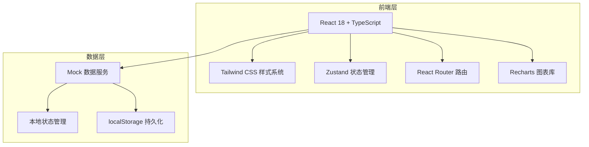
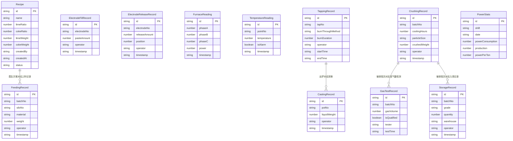

## 1. 架构设计



## 2. 技术说明

- **前端**：React@18 + TypeScript + Tailwind CSS@3 + Vite
- **初始化工具**：vite-init
- **后端**：无（纯前端，使用 Mock 数据）
- **数据库**：无（使用 localStorage + 内存状态管理）
- **图表库**：Recharts（用于趋势图、柱状图等数据可视化）
- **图标库**：lucide-react
- **状态管理**：Zustand

## 3. 路由定义

| 路由 | 用途 |
|------|------|
| / | 仪表盘总览页 |
| /raw-material | 原料配比页 |
| /feeding | 入炉上料页 |
| /electrode | 电极管理页 |
| /smelting | 冶炼控制页 |
| /tapping | 出炉浇铸页 |
| /crushing | 破碎包装页 |
| /power-stats | 电耗统计页 |

## 4. API定义

纯前端项目，使用 Mock 数据。所有数据通过 Zustand Store 管理，初始数据内置在代码中，运行时数据变更保存在 localStorage。

### 4.1 数据类型定义

```typescript
interface Recipe {
  id: string;
  name: string;
  limeRatio: number;
  cokeRatio: number;
  limeWeight: number;
  cokeWeight: number;
  createdBy: string;
  createdAt: string;
  status: 'active' | 'archived';
}

interface FeedingRecord {
  id: string;
  batchNo: string;
  siloNo: string;
  material: 'lime' | 'coke';
  weight: number;
  operator: string;
  timestamp: string;
}

interface ElectrodeFillRecord {
  id: string;
  electrodeNo: string;
  pasteAmount: number;
  operator: string;
  timestamp: string;
}

interface ElectrodeReleaseRecord {
  id: string;
  electrodeNo: string;
  releaseAmount: number;
  position: number;
  operator: string;
  timestamp: string;
}

interface FurnaceReading {
  id: string;
  phaseA: number;
  phaseB: number;
  phaseC: number;
  power: number;
  timestamp: string;
}

interface TemperatureReading {
  id: string;
  pointNo: string;
  temperature: number;
  isAlarm: boolean;
  timestamp: string;
}

interface TappingRecord {
  id: string;
  tapNo: string;
  burnThroughMethod: string;
  burnDuration: number;
  operator: string;
  startTime: string;
  endTime: string;
}

interface CastingRecord {
  id: string;
  potNo: string;
  liquidWeight: number;
  operator: string;
  timestamp: string;
}

interface CrushingRecord {
  id: string;
  batchNo: string;
  coolingHours: number;
  particleSize: string;
  crushedWeight: number;
  operator: string;
  timestamp: string;
}

interface GasTestRecord {
  id: string;
  batchNo: string;
  gasVolume: number;
  isQualified: boolean;
  tester: string;
  testTime: string;
}

interface StorageRecord {
  id: string;
  batchNo: string;
  grade: 'premium' | 'first' | 'qualified' | 'offgrade';
  quantity: number;
  warehouse: string;
  operator: string;
  timestamp: string;
}

interface PowerStats {
  id: string;
  shift: string;
  date: string;
  powerConsumption: number;
  production: number;
  powerPerTon: number;
}
```

## 5. 服务端架构图

不适用（纯前端项目）

## 6. 数据模型

### 6.1 数据模型定义



### 6.2 数据定义语言

使用 TypeScript 类型定义和 Zustand Store 内置初始数据，无需 SQL DDL。
